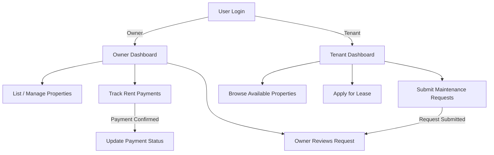
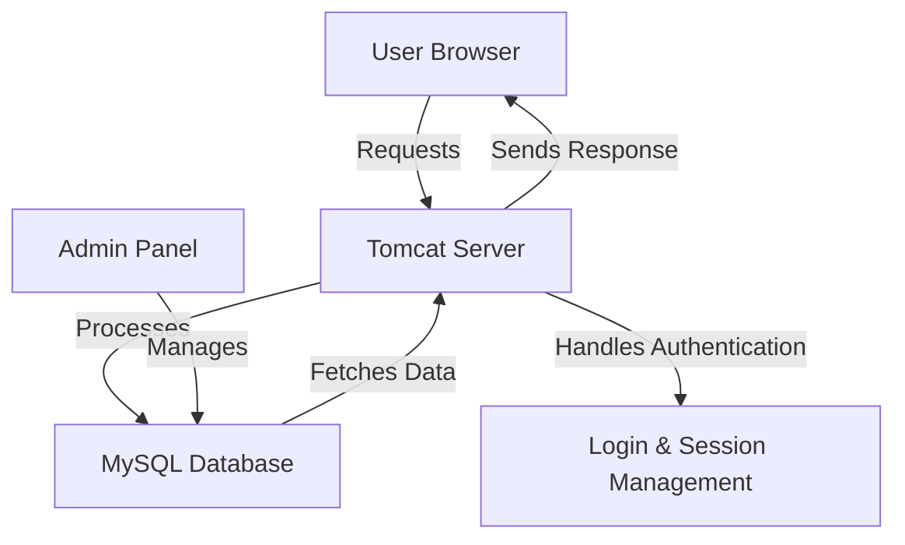

# 🏠 HomeMasters: Property Management System

## 🌍 Overview

**HomeMasters** is a web-based **Property Management System** developed using **JSP, Servlets, and MySQL**. It enables **property owners** to manage listings, handle tenant registrations, collect rent, and track maintenance requests efficiently. **Tenants** can browse available properties, sign lease agreements, and submit maintenance requests. The system ensures security with login authentication and session management.

---

## 👥 Users & Roles

### 🏠 Property Owners
- List, update, and remove properties.
- Track rent payments and pending dues.
- Respond to maintenance requests.
- Download reports on rental income.

### 🏡 Tenants
- Browse and apply for properties.
- Make rent payments and track payment history.
- Submit maintenance requests and contact landlords.
- Download lease agreements.

---

## 📊 Workflow Diagram



---

## 🏗 System Architecture



---

## ⭐ Features

### 🔑 Secure User Authentication
- **Role-based login** for **Property Owners & Tenants**.
- Password validation and **CAPTCHA-based authentication**.
- **Session management** to prevent unauthorized access.

### 🏠 Property Management
- Property owners can **list, update, and remove properties**.
- Supports **image uploads** for property listings.
- Automatic **property availability updates** after tenant leasing.

### 👥 Tenant Management
- Tenants can **register and browse available properties**.
- Lease agreements are managed digitally.
- **Download lease agreements as PDFs**.

### 💰 Rent Collection & Tracking
- Property owners can track **pending and completed rent payments**.
- Tenants can view **payment history**.

### 🛠 Maintenance Request System
- Tenants can submit **maintenance requests** to landlords.
- **Email notifications** sent for new requests.
- Landlords can update request status (Pending, Resolved, In Progress).

### 📊 Reports & Data Management
- Property owners can **generate reports** for rental income.
- Tenants can view **rental history & lease details**.
- **Database integration with MySQL** for secure data storage.

---

## 📥 Installation Guide

### Step 1: Clone the Repository
```sh
git clone https://github.com/DarshanScripts/property-management-system.git
```

### Step 2: Set Up the Database
1. Open **phpMyAdmin** (or any MySQL database manager).
2. Create a new database (e.g., `PropertyManagementSystem`).
3. Import the provided SQL schema from `src/java/Database/Schema.sql`.
4. Open `DBConnection.class` and update the database credentials:
```java
String url = "jdbc:mysql://localhost:3306/PropertyManagementSystem";
String user = "root";
String password = "";
```

### Step 3: Deploy the Application
1. Open **NetBeans / Eclipse** and load the project.
2. Configure **Tomcat Server** for JSP execution.
3. Run the project and access it at:
   ```sh
   http://localhost:8080/property-management-system/
   ```

---

## 📂 Project Structure

```
property-management-system/
│── build.xml                        # Apache Ant build configuration
│── web/
│   ├── index.html                    # Main landing page
│   ├── Owners/                       # Property Owner Portal
│   │   ├── AddProperty.jsp
│   │   ├── Dashboard.jsp
│   │   ├── Login.jsp
│   │   ├── Logout.jsp
│   │   ├── Registration.jsp
│   │   ├── valAddProperty.jsp        # Property validation
│   │   ├── validateLogin.jsp
│   │   ├── validateReg.jsp
│   ├── Tenant/                       # Tenant Portal
│   │   ├── Dashboard.jsp
│   │   ├── DownloadPDF.jsp
│   │   ├── Login.jsp
│   │   ├── Logout.jsp
│   │   ├── Registration.jsp
│   │   ├── SendEmail.jsp             # Contact property owner
│   │   ├── fetchData.jsp              # Fetch tenant details
│   │   ├── validateLogin.jsp
│   │   ├── validateReg.jsp
│   ├── WEB-INF/
│   │   ├── classes/
│   │   │   ├── Database/
│   │   │   │   ├── DBConnection.class  # Database connection logic
│   │   │   │   ├── Schema.sql          # Database schema
│   │   ├── lib/
│   │   │   ├── mysql-connector-j-8.1.0.jar # MySQL JDBC driver
│   ├── assets/
│   │   ├── jquery-3.2.1.min.js
│   ├── images/
│   │   ├── property1.jpg
│   │   ├── villa.jpg
│── nbproject/                        # NetBeans configurations
```

---

## 💻 Technologies Used
- **JSP & Servlets** – Backend logic and session management.
- **MySQL** – Database for storing properties, tenants, and transactions.
- **HTML, CSS, JavaScript** – Frontend UI.
- **AJAX & jQuery** – Real-time property updates.
- **Bootstrap** – Responsive design.
- **Tomcat Server** – Application deployment.

---

## 📜 License
This project is licensed under the **MIT License**.

---

## 👨‍💻 Author
Developed by **Darshan Shah**. Connect with me:

- **LinkedIn**: [Darshan Shah](https://www.linkedin.com/in/darshan-shah-tech/)
- **Facebook**: [DarshanScripts](https://www.facebook.com/DarshanScripts)
- **GitHub**: [DarshanScripts](https://github.com/DarshanScripts)
- **Quora**: [Darshan Shah](https://www.quora.com/profile/Darshan-Shah-1056)
- **Medium**: [DarshanScripts](https://medium.com/@DarshanScripts)
- **Fiverr**: [DarshanScripts](https://www.fiverr.com/darshanscripts)

